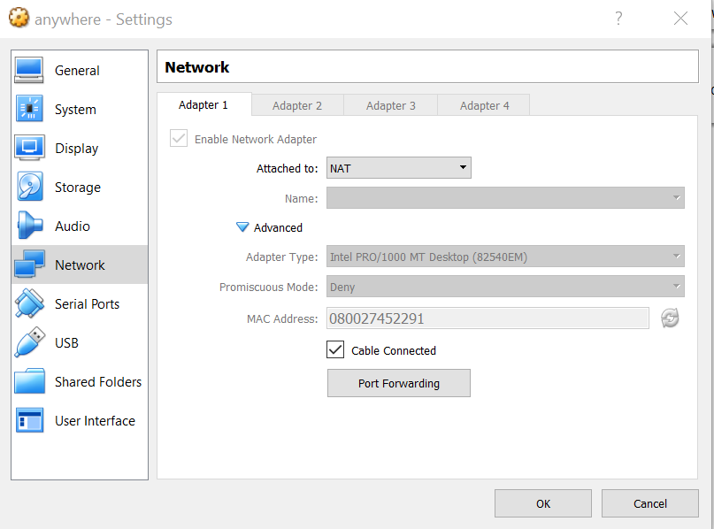
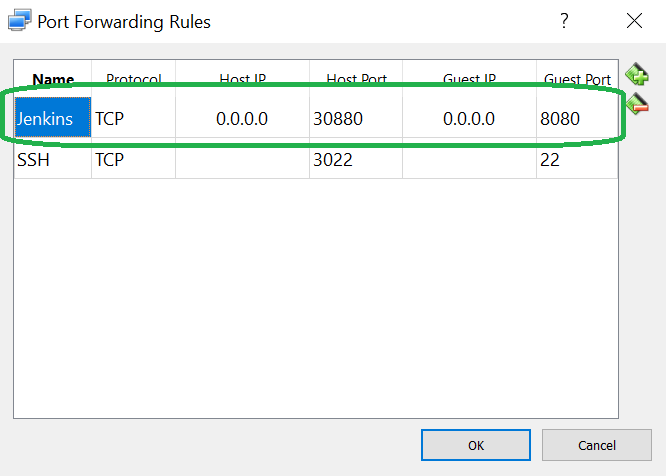
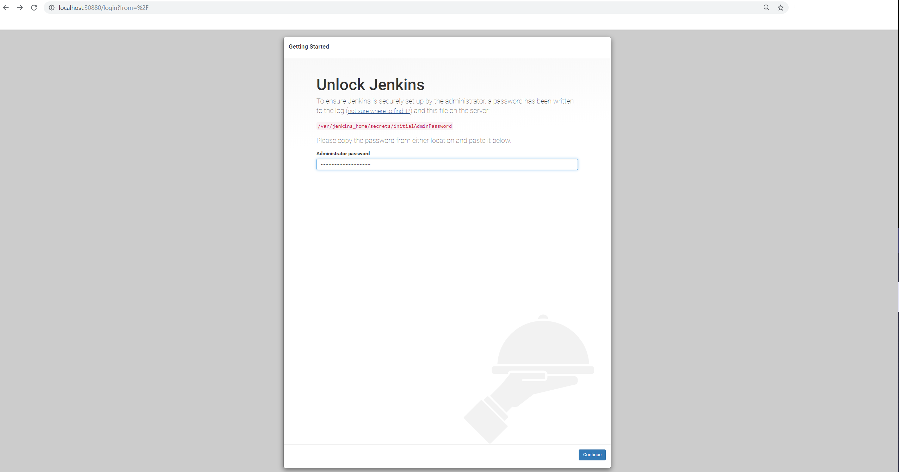
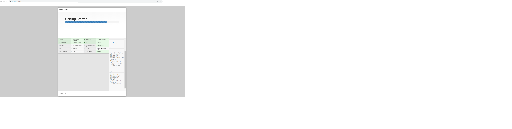
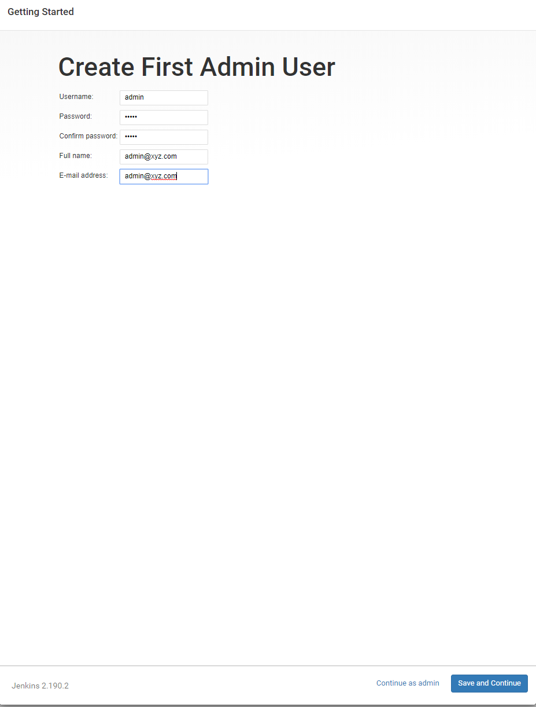
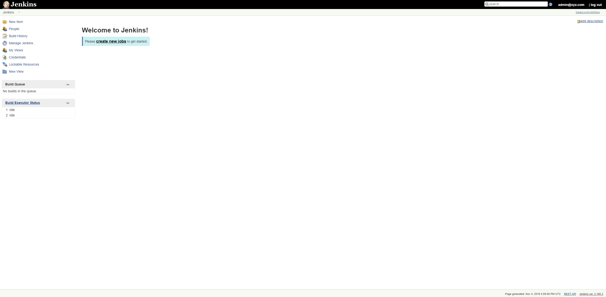

# Module 4 - Jenkins

## 1. Tích hợp liên tục

### 1.1 Thế nào là tích hợp?

Trong phát triển phần mềm, ***tích hơp*** (*integration*) là bước đưa phần code mà bạn đã phát triển vào phần code chung của dự án, đồng thời thực hiện kiểm tra chất lượng của phần code đó.

Lấy một ví dụ đơn giản với mô hình *git*. Giả sử dự án của bạn được lưu trữ trong một *kho* (*repository*), với nhánh chính **develop** được xem như nhánh lõi của dự án, chứa code ổn định mới nhất được phát triển. Khi một thành viên (A) phát triển và làm thay đổi code, A muốn cập nhật những thay đổi này vào nhánh lõi để các thành viên khác đều biết và cập nhật theo, anh ta gửi một *pull request* từ nhánh anh ta đã làm việc đến nhánh lõi. Các thành viên khác sẽ chấp thuận (*approve*) và sau đó trộn (*merge*) phiên bản code mới đó vào nhánh đó.

### 1.2 Thế nào là tích hợp liên tục?

Câu hỏi đặt ra: các thành viên khác *approve* như thế nào? Họ có thể tải phần code mới từ nhánh của A về, chạy các test hồi quy (*nonregression test*) hay test khác. Nếu test thành công, họ nhấn nút "approve" hay sau đó "merge". Quá trình này là một ví dụ của "tích hợp" diễn giải cho những ai đã làm quen với *git*.

Quy trình này hoàn toàn có thể tự động hóa, chẳng hạn bằng cách quy định cho một phần mềm nào đó lắng nghe mỗi lần có pull request muốn trộn code vào nhánh lõi *develop*. Phần mềm sẽ tải code mới về, chạy các test kiểm tra, sau đó approve và merge tự động vào nhánh lõi. Nếu test không thành công, người đề nghị pull request (thậm chí tất cả thành viên) sẽ nhận được email thông báo. Đây là ví dụ cho khái niệm **tích hợp liên tục** hay **tích hợp tự động** trong quy trình phát triển phần mềm. **Tích hợp liên tục** là tích hợp được thực hiện bởi một công cụ tự động, hạn chế sự can thiệp bằng tay (*manual*) từ con người.

Ngoài **tích hợp liên tục**, ta có thể nghĩ đến việc **giao sản phẩm liên tục** (*continuous delivery*) đơn giản như việc tạo ra một nhánh *release/x.y* từ nhánh *develop* đã được cập nhật (*merged*), như là sự ghi dấu cho việc phiên bản *x.y* của phần mềm đã ra đời. Thậm chí, ta có thể đẩy (*push*) phiên bản này lên môi trường kiểm tra (*test*, *qualification*, *staging*) một cách tự động để thay thế cho phiên bản cũ trước đó.

### 1.3 Jenkins

**Jenkins** được tạo ra với mục đích chính để thực hiện tích hợp liên tục và giao sản phẩm liên tục.

Ngoài ra, nhiều dự án còn sử dụng Jenkins như một tiện ích thực hiện các công việc (*job*) thường dành cho các *script*, đặc biệt là những việc được lên kế hoạch (*scheduled*) thực hiện theo chu kì một cách tự động.

Nhiều thông tin liên quan tại [jenkins.io](https://jenkins.io/).

*Jenkins* không phải là công cụ duy nhất được sử dụng trong tích hợp liên tục. Ta có thể nghĩ đến mô hình với các công cụ liên quan:

- Công cụ bảo trì code: *Git*/*Bitbucket*, ...
- Công cụ kiểm tra: *JUnit* hoặc ngay bản thân ngôn ngữ bạn dùng để viết code, ...
- Công cụ xuất bản: *Artifactory*, ... (dùng khi phiên bản cần giao hàng chứa nhiều định dạng hay chứa định dạng phức tạp)

*Jenkins* dễ dàng liên kết với nhiều công cụ trong chuối này thông qua các *giác cắm* (*plugin*) của nó.

## 2. Cài đặt Jenkins

Như đã nói ở các module trước, để dễ dàng minh họa và không phụ thuộc vào môi trường bạn đang làm việc, ta sử dụng Docker để minh họa cách cài đặt Jenkins.

Để xem hướng dẫn cài đặt trực tiếp, bạn có thể truy cập [trang ví dụ của jenkins.io](https://jenkins.io/doc/pipeline/tour/getting-started/).

### 2.1 Sao chép (*clone*) kho github cho docker jenkins

``` sh
anybody@anywhere:~/workspace $ git clone https://github.com/jenkinsci/docker.git
Cloning into 'docker'...
remote: Enumerating objects: 2639, done.
remote: Total 2639 (delta 0), reused 0 (delta 0), pack-reused 2639
Receiving objects: 100% (2639/2639), 606.23 KiB | 1.35 MiB/s, done.
Resolving deltas: 100% (1414/1414), done.
```

### 2.2 Chuyển đến thư mục vừa tải

```sh
anybody@anywhere:~/workspace $ mv docker jenkins-docker

# Đổi tên để tiện làm việc
anybody@anywhere:~/workspace $ cd jenkins-docker/

# Kiểm tra bên trong thư mục
anybody@anywhere:~/workspace/jenkins-docker master ± ls
CHANGELOG.md        Dockerfile-jdk11    jenkins-support          publish.sh
CONTRIBUTING.md     Dockerfile-slim     LICENSE.txt              README.md
docker-compose.yml  HACKING.adoc        Makefile                 tests
Dockerfile          install-plugins.sh  multiarch                tini_pub.gpg
Dockerfile-alpine   Jenkinsfile         plugins.sh               tini-shim.sh
Dockerfile-centos   jenkins.sh          publish-experimental.sh  tools
```

### 2.3 Chạy container docker

```sh
# Chạy docker, mở cổng 8080 cho ứng dụng web và 50000 cho ứng dụng khác
anybody@anywhere:~/workspace/jenkins-docker master ± docker run -p 8080:8080 -p 50000:50000 jenkins/jenkins:lts
Running from: /usr/share/jenkins/jenkins.war

...

Jenkins initial setup is required. An admin user has been created and a password generated.
Please use the following password to proceed to installation:
# QUAN TRỌNG: Copy password này để cài đặt trên giao diện
2cbfe5490ea14622abfb8c941358ee34

This may also be found at: /var/jenkins_home/secrets/initialAdminPassword

*************************************************************
*************************************************************
*************************************************************

2019-11-04 16:40:16.615+0000 [id=46]	INFO	hudson.model.UpdateSite#updateData: Obtained the latest update center data file for UpdateSource default
2019-11-04 16:40:17.292+0000 [id=30]	INFO	hudson.model.UpdateSite#updateData: Obtained the latest update center data file for UpdateSource default
2019-11-04 16:40:17.694+0000 [id=30]	INFO	jenkins.InitReactorRunner$1#onAttained: Completed initialization

# Đây là dòng cho thấy Jenkins đã được cài đặt thành công
2019-11-04 16:40:17.720+0000 [id=20]	INFO	hudson.WebAppMain$3#run: Jenkins is fully up and running
2019-11-04 16:40:18.157+0000 [id=46]	INFO	h.m.DownloadService$Downloadable#load: Obtained the updated data file for hudson.tasks.Maven.MavenInstaller
2019-11-04 16:40:18.158+0000 [id=46]	INFO	hudson.util.Retrier#start: Performed the action check updates server successfully at the attempt #1
2019-11-04 16:40:18.161+0000 [id=46]	INFO	hudson.model.AsyncPeriodicWork$1#run: Finished Download metadata. 8,706 ms
```

### 2.4 Sử dụng cài đặt Virtual Box chuyển tiếp (*forward*) cổng máy ảo sang máy chính

Ví dụ, chuyển tiếp cổng 8080 từ máy ảo (máy khách, *guest*) sang 30880 của máy chính (máy chủ, *host*) bằng cách chọn: `Settings -> Network -> Advanced -> Port Forwarding`.
<center>
    
</center>

Sau đó điền luật chuyển tiếp như sau:
<center>
    
</center>

Bạn có thể chọn tên luật tùy ý. IP máy ảo và máy chính có thể dùng `"0.0.0.0"`. Bạn cũng có thể dùng cổng khác của máy chủ thay vì 30880.

### 2.5 Cài đặt với giao diện web trên máy chính

Sau bước 2.4, lúc này bạn có thể truy cập giao diện web của Jenkins tại `http://localhost:30880`. Thay `30880` nếu bạn sử dụng cổng khác.

Điền password đã lưu từ terminal vào khung trống

<center>
    
</center>

Ở bước tiếp theo: chọn **`Install suggested plugins`**. Ứng dụng sẽ được cài đặt, bạn đồng thời sẽ nhìn thấy các dòng logs tại terminal trong máy ảo nơi bạn đã gõ lệnh chạy *Jenkins* với *docker*. Đồng thời logs và quá trình cài đặt cũng hiện ra trên giao diện web.

<center>
    
</center>

### 2.6 Khai báo quản trị viên

Sau bước 2.5, Jenkins sẽ đưa bạn đến trang dành cho khai báo quản trị viên. Chẳng hạn, ta khai báo quản trị viên `admin`.

<center>
    
</center>

Nháy vào `Save and Continue`. Trang ***Instance Configuration*** mở ra với URL của Jenkins được định sẵn là *`http://localhost:30880/`*. Đến đây việc cài đặt *Jenkins* hoàn tất. Bạn có giao diện như sau:

<center>
    
</center>

## 3. Ví dụ 1: Sử dụng Jenkins như một *mẫu* (*form*) để thực hiện một công việc

## 4. Ví dụ 2: Kiểm tra tự động với Jenkins

## 5. Ví dụ 3: Trộn tự động với Jenkins

## 6. Ví dụ 4: Giao hàng tự động với Jenkins
