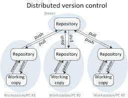
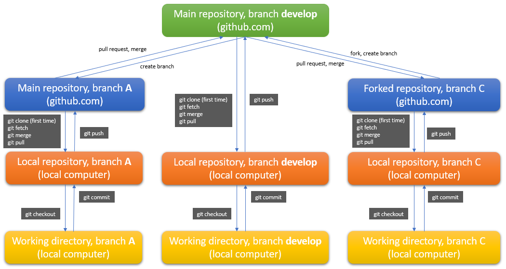
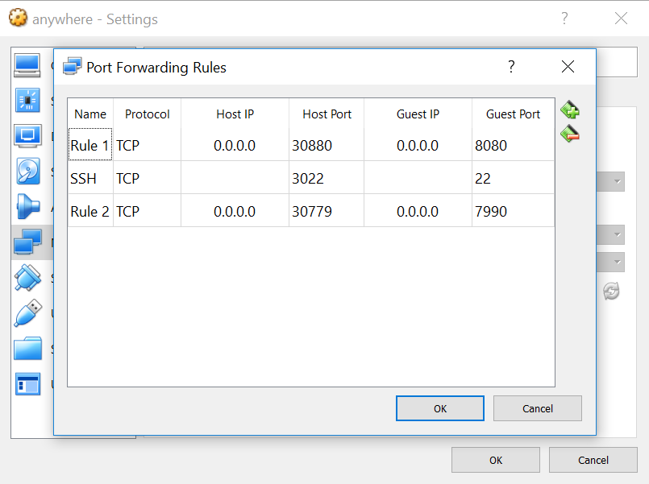
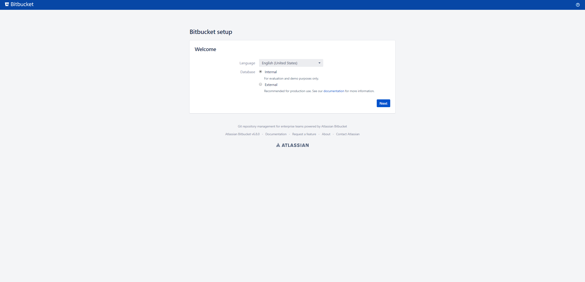
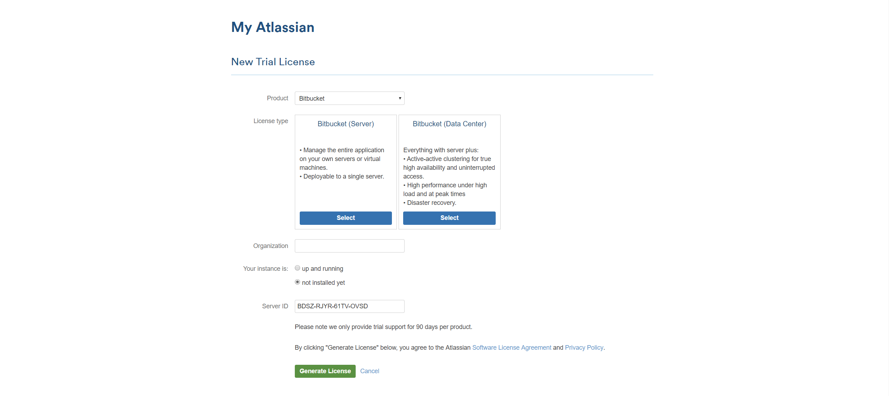
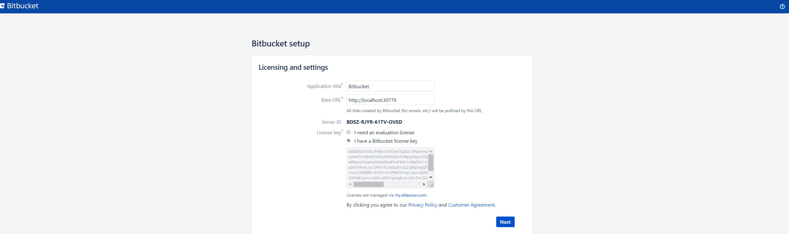

# Module 2 - Git. Github. Bitbucket

## 1 Hệ quản lí phiên bản

### 1.1 Quản lí phiên bản

Tưởng tượng bạn làm việc nhiều người trong cùng một dự án, trên cùng một tập hợp các file code và dữ liệu. Tất cả các thành viên đều thay đổi thường xuyên code và mỗi người, sau một thời gian, cần dùng phiên bản code mới được cập nhật bởi các thành viên code. Sẽ là tai họa nếu không có một sự quản lí tập trung các phiên bản code mà mỗi người làm việc.

Bạn có thể liên tưởng đến *Google Drive*/*Google Docs* khi mọi thành viên làm việc trên cùng một tài liệu và xem đây là một giải pháp. Nghĩa là:

- Các thành viên làm việc trực tiếp trên một file
- Các thành viên đều phải có mạng để truy cập đến file đó.

Giải pháp này dẫn đến vấn đề: các va chạm sẽ diễn ra thường xuyên, đặc biệt khi các thành viên sửa chữa tài liệu tại cùng một dòng. Tình huống còn nghiêm trọng hơn khi đối tượng ta làm việc là code chứ không phải tài liệu. Nếu bạn dùng phiên bản tại thời điểm *A* nào đó khi các thành viên khác chưa viết xong một câu lệnh, hiển nhiên code sẽ lỗi và không thực hiện được.

Đấy là lí do ta cần một **hệ quản lí phiên bản** (**Version Control System** hay **VCS**). Code của dự án sẽ được lưu trữ trong một *thư mục* hay *kho* (với *git* sẽ tìm hiểu ở phần tiếp theo, thuật ngữ tiếng Anh là **repository**). Mỗi thành viên sẽ tải về một phiên bản, làm việc trên đó để đám bảo tính cục bộ (*local*) và độc lập với các thành viên khác. Chỉ khi việc cập nhật code trở nên hoàn chỉnh, thành viên mới cập nhật code vào kho chính online.

**Hệ quản lí phiên bản** giúp quản lí code và lịch sử thay đổi, từ đó bạn có thể quay lại một phiên bản trước đó, hoặc dùng một phiên bản do người khác cập nhật nếu cần.

### 1.2 Hệ quản lí phiên bản tập trung

Hình dưới đây mô tả một **hệ quản lí phiên bản tập trung** (**centralized version control system**).


(Nguồn: [homes.cs.washington.edu](http://homes.cs.washington.edu))

Theo đó, có một *kho* (**repository**) online (vẽ ở tầng trên cùng). Các thành viên sẽ tải kho này về thành các thư mục cục bộ (*working copy* trong hình). Hành động tải này được thể hiện bằng mũi tên *update* trong hình. Sau khi sửa chữa code, thành viên cập nhật phiên bản thư mục cục bộ của mình lên kho online. Hành động này được thể hiện bằng mũi tên *commit*. Hệ quản lí phiên bản tập trung hay được sử dụng nhất là [Subversion](https://subversion.apache.org/). Nhìn chung, nếu có hai thành viên cùng sửa chữa từ một phiên bản code online (tạm gọi là *A*) và *commit* 2 phiên bản mới (tạm gọi là *B1* và *B2*), hệ cho phép trộn lẫn hai phiên bản này thành một phiên bản chung (*B*) gồm cả các thay đổi của hai người, nếu chúng không va chạm (*conflict*) với nhau.

### 1.3 Hệ quản lí phiên bản phân tán

Với một **hệ quản lí phiên bản phân tán** (**distributed version control system**):



(Nguồn: [homes.cs.washington.edu](http://homes.cs.washington.edu))

Ta thấy có thêm một tầng *online* nữa nằm giữa kho chính và các thư mục cục bộ. Đó chính là các phiên bản *online* hoặc *offline* khác, ban đầu được sao chép từ kho chính, được biểu diễn bằng *Repository* trong tầng giữa của hình vẽ. Trong *Github* các kho này có thể được gọi bằng khái niệm **nhánh** (**branch**) nếu phiên bản được sao chép nằm ở cùng tài khoản với kho gốc; hoặc được gọi là **bản sao**/**bản chĩa** (**fork**) nếu nó nằm ở nằm ở tài khoản của người dùng. Dù gọi là gì, chúng vẫn là một phiên bản *online* của kho chính. Các thành viên *update* và *commit* trên các phiên bản (*fork*, *branch*) này. Việc cập nhật code lên kho chính thức được thực hiện bằng các thao tác riêng (mô tả bằng **pull** và **push** trong hình vẽ).

#### Chú ý:

Hình vẽ trên mô tả đơn giản khái niệm *hệ quản lí phiên bản phân tán*, tuy vậy nó chưa đầy đủ với **git**. Trên thực tế, ngoài các động từ *pull*, *push*, ta còn có *clone*, *fork*, *create branch*, *pull request*, *merge* với các chức năng khác nhau. Ta sẽ tìm hiểu kĩ hơn trong các phần tiếp theo.

### 1.4 Ưu điểm của *hệ quản lí phiên bản phân tán* so với *hệ tập trung*

Bài báo tại [itviec.com](https://itviec.com/blog/git-la-gi/) nêu quan điểm của những người có kinh nghiệm về việc tại sao hệ phân tán có ưu thế hơn (*Sắp xếp công việc tốt hơn*, *Linh hoạt khi làm nhiều công việc*, *Tự tin thể hiện ý tưởng mới etc.*). Các lợi ích này đều bắt nguồn từ tính độc lập lẫn nhau giữa các nhánh.

## 2 Git

Mô tả ở phần 1 là mô hình cơ bản của *hệ quản lí phiên bản phân tán*. **git** là *framework* (*cơ cấu*) cho hệ quản lí loại này, với mô hình cụ thể hơn như sau:



Ta sẽ giải thích các tầng và các khái niệm trong mô hình.

Cơ cấu được tổ chức bằng cách ở hai cấp *remote* (*online*, với code được lưu trong một sản phẩm online như **Github**, **Bitbucket**) và  hay *local* (hay *offline*, với code được lưu trong máy người dùng). Hai tầng trên cùng trong hình là tầng *remote*, hai tầng dưới là *local*.

Phần này chỉ mô tả sơ lược các khái niệm. Về ví dụ thực hành, ta tìm hiểu ở phần 3 và 4 sau.

## 2.1 Các khái niệm

Trong hình vẽ,

- **Remote repository** là một *thư mục*/*kho* online chứa code của dự án. Các hộp màu xanh lá cây và xanh dương là các *remote repository*.

- **Main repository** (đôi khi được gọi là *upstream*) là thư mục/kho code chính của dự án. Trong thư mục này có một nhánh (**branch**), thường được đặt tên là **develop**, là nhánh chính của dự án. Trong hình vẽ, hộp màu xanh lá với branch *develop* là *main repository* và *branch* chính của dự án.

- **(Remote) Branch** là một copy của một *repository*, có thể mang code giống hay khác branch chính của *main repository*. Trong hình vẽ, hộp xanh dương bên trái mô tả một *branch* của *main repository*.

- **Forked repository** là thư mục/kho code được copy từ *main repository* về tài khoản của một người dùng khác (trên *Github* hay sản phẩm quản lí phiên bản online). *Forked repository* chứa các *branch* từ *main repository* và người dùng cũng có thể tạo các *branch* khác. Trong hình vẽ, hộp xanh dương bên phải mô tả một *branch* của *main

Như vậy, ở cấp online, một phiên bản code tại một thời điểm được đồng nhất với một nhánh (*branch*) của một kho (*repository*) tại thời điểm đó. 

Tại cùng thời điểm có thể tồn tại nhiều phiên bản code khác nhau (ứng với nhiều người dùng khác nhau, tại các phần dự án khác nhau).

Tiếp theo,

- **Local repository**, **local branch** là cấu trúc git copy từ phiên bản online (*remote repository*, *remote branch*) về máy tính người dùng, chứa cấu trúc git. Trong hình vẽ, nó ứng với tầng thứ ba (các hộp màu da cam). Người ta cũng gọi tầng này là *staging environment*.

- **Working directory** là phiên bản code được lưu trên máy người dùng ứng với branch mà người dùng đang làm việc ở thời điểm hiện tại. Nó được lưu trong một thư mục trong máy tính cá nhân người dùng.

Trong hình vẽ cũng đưa ra 3 phương án tiếp cận với *main repository*. Ở nhánh giữa, người dùng tải trực tiếp *main repository* về *local repository*. Ở nhánh bên trái, người dùng tạo một nhánh (*branch*) online trong chính *main repository* và tải phiên bản đó về *local repository*. Ở nhánh bên phải, người dùng copy *main repository* về tải khoản riêng, thành *forked repository* và tải phiên bản đó về *local repository*.

## 3 Github

## 4 Bitbucket

Trong khóa học này, ta cần kết nối hệ quản lí phiên bản với nhiều công cụ khác như *Jenkins*, *Artifactory*. Vì vậy ta muốn hệ quản lí phiên bản của mình được cài đặt ở dạng *offline* (*cục bộ*). Ta có thể sử dụng phiên bản tương tự *Github* là *Gitlab*. Trong module này ta sẽ sử dụng một sản phẩm khác là ***Bitbucket***. (Tất nhiên, *Bitbucket* cũng là một sản phẩm online)

### 4.0 Tạo một tài khoản tại *Atlassian.com*

### 4.1 Cài đặt **Bitbucket**

Để cài đặt trực tiếp trên máy, bạn có thể truy cập hướng dẫn tại [trang chủ của *Bitbucket*](https://confluence.atlassian.com/bitbucketserver/bitbucket-server-installation-guide-867338382.html)

#### 4.1.1 Cài đặt bằng *Docker*

Bạn đã biết *Docker* từ bài học trước, ta sẽ cài đặt Bitbucket bằng *Docker* trong máy ảo của mình như sau.

``` sh
anybody@anywhere:~ $ docker run -v bitbucketVolume:/var/atlassian/application-data/bitbucket --name="bitbucket" -d -p 7990:7990 -p 7999:7999 atlassian/bitbucket-server
Unable to find image 'atlassian/bitbucket-server:latest' locally
latest: Pulling from atlassian/bitbucket-server
7ddbc47eeb70: Pull complete
c1bbdc448b72: Pull complete
8c3b70e39044: Pull complete
45d437916d57: Pull complete
8737a9150f8e: Pull complete
1b5883079eff: Pull complete
60518866f62d: Pull complete
ec950f0d63d6: Pull complete
cb3e642b1f6a: Pull complete
7d276baa5e54: Pull complete
e5479665ca81: Pull complete
bc013d6a626c: Pull complete
18fe480ef142: Pull complete
Digest: sha256:45e7d31926fff661ff264bb49f724f7deb134e926b73a15b77b64e36012cd690
Status: Downloaded newer image for atlassian/bitbucket-server:latest
3b6dcca4f34c7b2551bf9dc142e3c5cc74d96ed13ace6d2a8430f2c7d0d760a7
```

#### 4.1.2 Chuyển tiếp cổng trong *Virtual Box*

Nếu bạn không dùng máy ảo, có thể truy cập ứng dụng tại `http://localhost:7990`. Nếu không, chuyển tiếp *forward* cổng này ra ngoài trong cài đặt *Virtual Box* bằng cách chọn `Settings -> Network -> Advanced -> Port Forwarding`.


Sau đó điền luật chuyển tiếp như ở dòng *Rule 2*. (Có thể thay cổng `30779` bằng cổng khác.)



Lưu và mở lại máy ảo. Từ đây, *Bitbucket* có thể truy cập *Bitbucket* tại `localhost:30779`. Màn hình với **Bitbucket setup** xuất hiện.



#### 4.1.3 Tùy chỉnh trên trang web

- Ta chọn ngôn ngữ và chọn database **Internal**. Nhấn next.
- Lưu lại **Server ID** (chẳng hạn `BDSZ-RJYR-61TV-OVSD`). Nếu chưa có **license key**, chọn **I need an evaluation license**.
- Chọn "I have ...", lúc này ta được chuyển tiếp về trang của *Atlassian*. Chọn **Bitbucket (Server)**. Chọn **Your instance is: not installed yet**. Số *server ID* được điền tự động. Nếu không ta copy giá trị đã lưu ở bước trước. Sau cùng click **Generate License**.



- License key hiện ra (bạn sẽ tìm thấy sau này khi đăng nhập lại vào *Atlassian*). Chọn **Yes** cho pop-up **Confirmation** hiện ra.
- Bây giờ license key sẽ được nhập vào trang cài đặt



- Nhấn next và nhập các thông tin. Ta chọn **username** là `admin`.
- Chọn **Go to Bitbucket** (bỏ qua phần *Integrate with Jira*).
- Trang **Log in** hiện ra. Đăng nhập với *username* và *password* ở bước trước.

Đến đây, quá trình cài đặt hoàn tất. Ta có thể tắt và bật Bitbucket nếu cần bằng

``` sh
anybody@anywhere:~ $ docker stop bitbucket
bitbucket
anybody@anywhere:~ $ docker start bitbucket
bitbucket
```

## Nguồn tư liệu

1. [confluence.atlassian.com/bitbucketserver](https://confluence.atlassian.com/bitbucketserver/bitbucket-server-installation-guide-867338382.html)
2. [hub.docker.com](https://hub.docker.com/r/atlassian/bitbucket-server/)
3. [subversion.apache.org](https://subversion.apache.org/)
